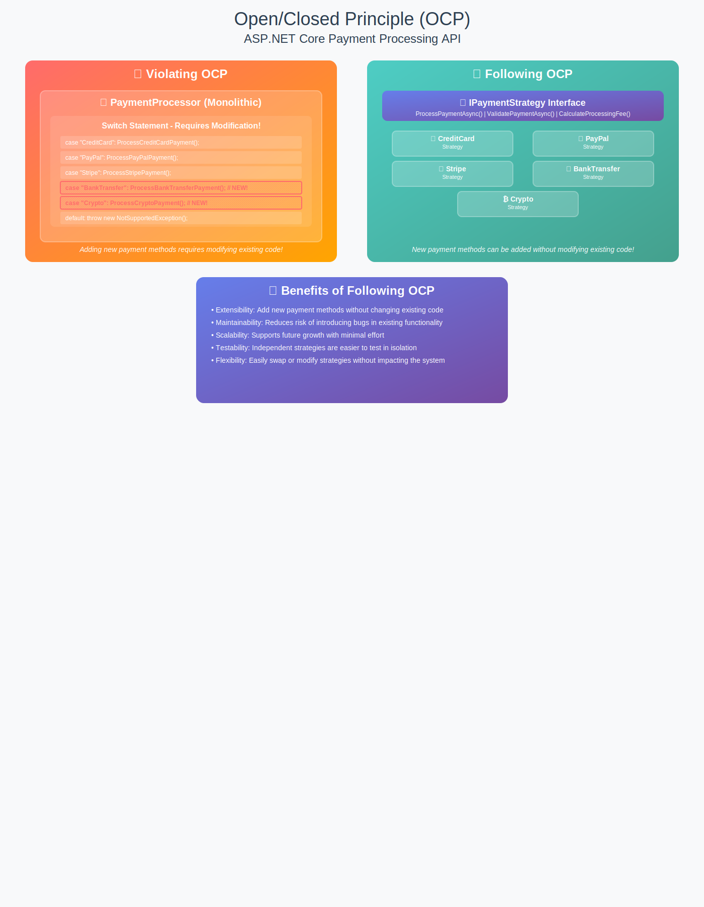

# SOLIDExamples (.NET 8)

## Overview
This project demonstrates the Single Responsibility Principle (SRP) in an ASP.NET Core API using .NET 8. It includes both a well-structured, SRP-compliant user management system and an example of a class that violates SRP for comparison.

## What is SRP?
**Single Responsibility Principle** states that a class should have only one reason to change, meaning it should have only one job or responsibility. Following SRP leads to code that is easier to maintain, test, and extend.

## Project Structure
```
SOLIDExamples/
?
??? Controllers/
?   ??? UsersController.cs         # Handles HTTP requests for user registration
?
??? Models/
?   ??? Models.cs                 # Contains User, UserRegistrationDto, ValidationResult, ApiResponse<T>
?
??? Services/
?   ??? UserValidator.cs          # Validates user registration data
?   ??? PasswordService.cs        # Handles password hashing and verification
?   ??? UserRepository.cs         # Handles data access for users (SQL Server)
?   ??? EmailService.cs           # Sends emails (SMTP)
?   ??? LoggerService.cs          # Logging abstraction
?   ??? UserService.cs            # Coordinates user registration (SRP-compliant)
?   ??? UserServiceSRPViolation.cs# Example of a class that violates SRP
?
??? Program.cs                    # Configures services and starts the app
??? ...
```

## How to Run
1. Ensure you have .NET 8 SDK installed.
2. Set up your database and update the connection string in `appsettings.json` under `DefaultConnection`.
3. Configure email settings in `appsettings.json` under the `Email` section.
4. Restore dependencies:
   ```
   dotnet restore
   ```
5. Build and run the project:
   ```
   dotnet run --project SOLIDExamples/SOLIDExamples.csproj
   ```
6. Use Swagger (enabled in development) or Postman to test the registration endpoint:
   - POST `/api/users/register`

## Comparing SRP Approaches
- **SRP-compliant:** See `Services/UserService.cs` and related service files. Each class has a single responsibility.
- **SRP-violating:** See `Services/UserServiceSRPViolation.cs`. This class mixes validation, business logic, data access, email, and logging.

## Benefits of SRP
- Easier testing
- Better maintainability
- Improved reusability
- Clear separation of concerns
- Easier to extend and modify

---

**Feel free to explore and modify the code to see the impact of following or violating SRP!**


## Open/Closed Principle (OCP) in ASP.NET Core API

### What is Open/Closed Principle?
The Open/Closed Principle states that **software entities (classes, modules, functions) should be open for extension but closed for modification**. You should be able to extend a class's behavior without modifying its existing code.

### Real-Time Example: Payment Processing API
This project demonstrates OCP with a Payment Processing API supporting multiple payment methods (Credit Card, PayPal, Stripe, Bank Transfer, Cryptocurrency, Apple Pay, etc.).

#### ❌ BAD Example - Violating OCP
A single class with a switch statement for each payment method. Adding new methods requires modifying the class, risking bugs and violating OCP.

#### ✅ GOOD Example - Following OCP
- **Strategy Pattern**: Each payment method is implemented as a separate strategy class.
- **Factory Pattern**: A factory resolves the correct strategy based on the payment method.
- **Dependency Injection**: New payment methods are registered in DI without modifying existing code.
- **Controller**: The API controller uses abstractions and is closed for modification.

#### Benefits
- **Easy Extension**: Add new payment methods by creating new strategy classes.
- **Reduced Risk**: Existing code remains untouched when adding features.
- **Better Testing**: Each payment strategy can be tested independently.
- **Improved Maintainability**: Changes are isolated to specific strategies.
- **Scalable Architecture**: System can grow without breaking existing features.

#### Key Takeaways
- **Open for Extension**: New functionality via new classes.
- **Closed for Modification**: No changes to existing code for new features.
- **Polymorphism & DI**: Use interfaces and DI for extensibility.

---

### Project Structure
- `Models/Models.cs`: Payment models, enums, and DTOs.
- `Services/Payment/`: Payment strategies, factory, and processor.
- `Controllers/PaymentsController.cs`: API endpoints for payment processing.
- `Program.cs`: DI setup for payment strategies and services.

---

### How to Add a New Payment Method
1. Create a new class implementing `IPaymentStrategy`.
2. Register the new strategy in `Program.cs` and the factory.
3. No changes required to controller or processor.

---

#### This approach makes the ASP.NET Core API extensible, maintainable, and SOLID-compliant.
